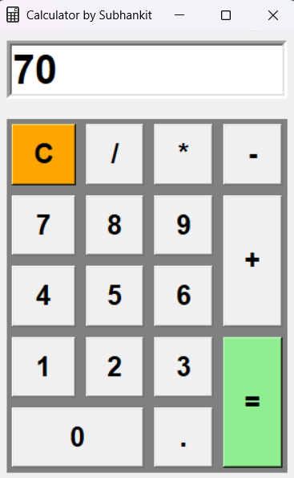

## My Old Tkinter Projects

This repository is a personal project to revisit, clean up, and document some of my earlier projects built with Python's Tkinter library. It's an exercise in appreciating how far I've come and giving my old work a proper, organized home.

## Projects

Here are the projects included in this repository:

### 1. Tkinter Calculator

A simple, functional GUI calculator built with Python and Tkinter. It handles basic arithmetic operations with a clean, grid-based layout.

#### **Features**
* Addition, Subtraction, Multiplication, Division
* Clear function to reset the input
* Responsive layout that expands with the window

#### **Screenshots**

| Standard Layout                                    | Example Calculation                                        |
| :------------------------------------------------: | :--------------------------------------------------------: |
|    |       |

 

### 2. Tkinter Notepad

A classic text editor application with essential features, mimicking the functionality of a basic notepad.

#### **Features**
* File Menu: New, Open, Save, and Save As functionality.
* Standard text editing capabilities.
* Simple and intuitive user interface.

#### **Screenshots**

| Initial State                                    | Saving a File                                      |
| :----------------------------------------------: | :------------------------------------------------: |
|  |  |
| **Menu Options** | **Saved File in Explorer** |
|        |       |

## Folder Structure

### Folder Structure

- `calculator.py`
- `notepad.py`
- `README.md`
- `icons/`
  - `1.ico`
  - `2.ico`
  - `3.ico`
- `screenshots/`
  - `screenshot1.png`
  - `screenshot2.png`
  - `screenshot3.png`
  - `screenshot4.png`
  - `screenshot5.png`
  - `screenshot6.png`

## How to Run

These projects were built using standard Python libraries and are best run using IDLE.

1.  **Prerequisites:**
    * Python 3.x (Tkinter is included with most Python installations).

2.  **Download the Project:**
    * Click the green "Code" button on this repository's main page.
    * Select "Download ZIP".

3.  **Extract the Files:**
    * Find the downloaded `.zip` file on your computer and extract it. This will create a folder named `Old-TKinter-Projects-main` (or similar).

4.  **Run with Python IDLE:**
    * Open the extracted folder.
    * To run an application, right-click on its file (e.g., `calculator.py` or `notepad.py`).
    * From the context menu, choose "Edit with IDLE".
    * When the file opens in the IDLE editor, press the **F5** key on your keyboard. The application window will appear.
